# Crear tabla member:

CREATE TABLE member(
id SERIAL,
fullname VARCHAR (100) NOT NULL,
email VARCHAR (200) NOT NULL,
age INT NOT NULL,
PRIMARY KEY (id)
);

# Crear tabla event:

CREATE TABLE event(
id SERIAL,
start_date DATE NOT NULL,
end_date DATE NOT NULL,
city VARCHAR (50) NOT NULL,
PRIMARY KEY (id)
);
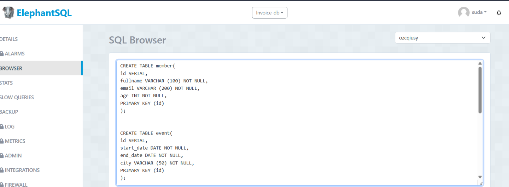

# Crear tabla conferencia:

CREATE TABLE conference (
    id INT PRIMARY KEY,
    title VARCHAR(100),
    speaker VARCHAR(100),
    hour TIME,
    day DATE,
    total_attendees INT,
    event_id INT,
    FOREIGN KEY (event_id) REFERENCES event(id)
);

# Crear tabla register:

CREATE TABLE register (
    id INT PRIMARY KEY,
    member_id INT,
    conference_id INT,
    registered_at DATE,
    assisted BOOLEAN,
    FOREIGN KEY (member_id) REFERENCES member(id),
    FOREIGN KEY (conference_id) REFERENCES conference(id)
)
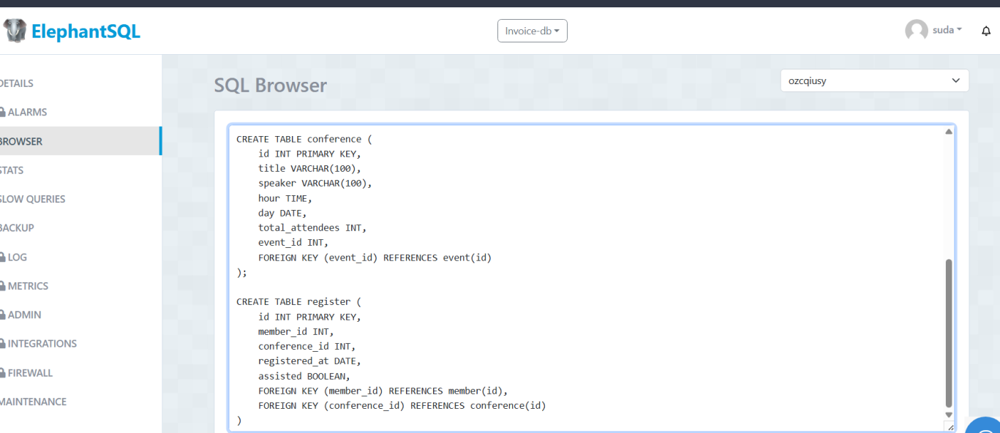

**Insertar valores a la tabla member:**

INSERT INTO member (fullname, email, age) VALUES
('Alice Johnson', 'alice.johnson@example.com', 34),
('Bob Smith', 'bob.smith@example.com', 28),
('Charlie Brown', 'charlie.brown@example.com', 45),
('Diana Prince', 'diana.prince@example.com', 30),
('Evan Green', 'evan.green@example.com', 26);
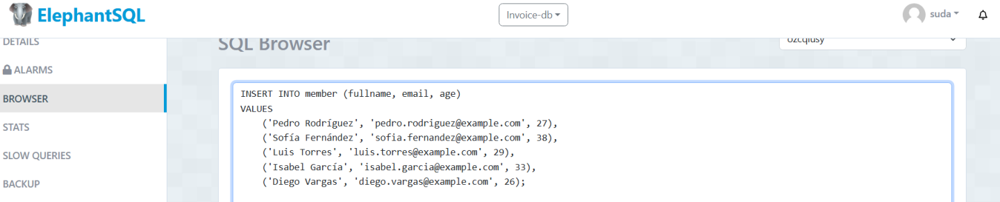

**Insertar valores a la tabla event:**

INSERT INTO event (start_date, end_date, city) VALUES
('2023-07-10', '2023-07-12', 'New York'),
('2023-08-15', '2023-08-16', 'Los Angeles'),
('2023-09-01', '2023-09-03', 'Chicago'),
('2023-10-05', '2023-10-07', 'Houston'),
('2023-11-20', '2023-11-22', 'Miami');
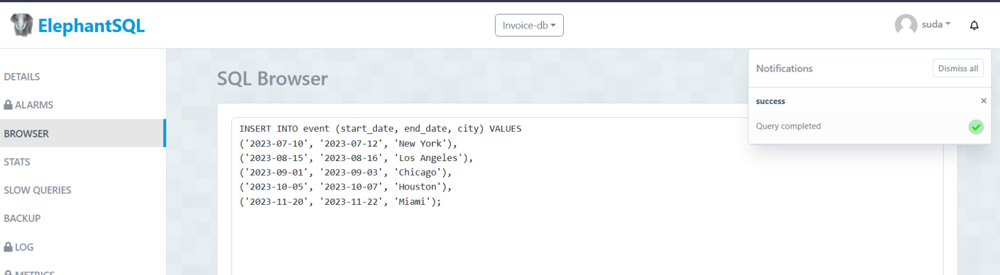

**Insertar valores a la tabla conference:**
INSERT INTO conference (id, title, speaker, hour, day, total_attendees, event_id) VALUES
(1, 'Tech Innovations 2023', 'Dr. Sarah Connor', '10:00:00', '2023-07-10', 150, 1),
(2, 'Future of AI', 'Elon Musk', '14:00:00', '2023-07-11', 200, 1),
(3, 'Healthcare Advances', 'Dr. Meredith Grey', '09:00:00', '2023-08-15', 100, 2),
(4, 'Climate Change Solutions', 'Greta Thunberg', '11:00:00', '2023-09-01', 180, 3),
(5, 'Blockchain Revolution', 'Vitalik Buterin', '13:00:00', '2023-10-05', 220, 4);
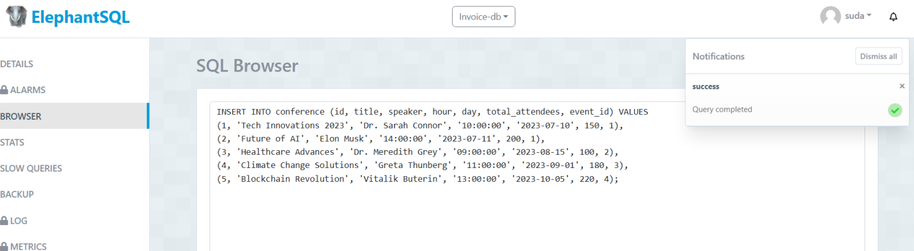

**Insertar valores a la tabla register:**

INSERT INTO register (id, member_id, conference_id, registered_at, assisted) VALUES
(1, 1, 1, '2023-06-01', TRUE),
(2, 2, 2, '2023-06-15', TRUE),
(3, 3, 3, '2023-07-20', FALSE),
(4, 4, 4, '2023-08-10', TRUE),
(5, 5, 5, '2023-09-15', FALSE);
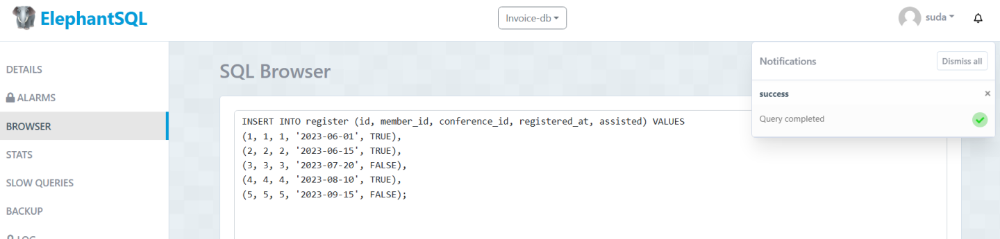

**CONSULTAS**
1. Filtrar a los miembros que tengan más de 30 años de edad:
SELECT * FROM member
WHERE age > 30;
El comando que proporcionaste es una consulta SQL que recupera todas las columnas de la tabla member donde el valor de la columna age es mayor que 30.
En otras palabras, esta consulta selecciona todos los registros de la tabla member donde la edad (age) de los miembros es mayor que 30.
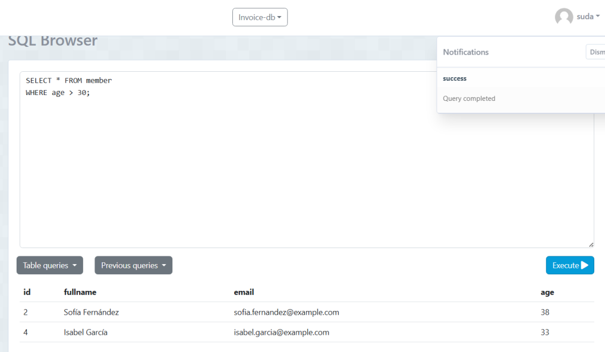

2. Filtrar las conferencias que se realizaron dentro de un es completo:
SELECT * FROM conference
WHERE day BETWEEN '2023-08-01' AND '2023-08-31';
selecciona todas las columnas de la tabla conference donde el valor de la columna day se encuentra entre el 1 de agosto de 2023 y el 31 de agosto de 2023, inclusive.
En otras palabras, esta consulta devuelve todos los registros de la tabla conference que corresponden a conferencias que tuvieron lugar durante el mes de agosto de 2023. La cláusula BETWEEN se utiliza para especificar un rango de valores inclusivo para la columna day.
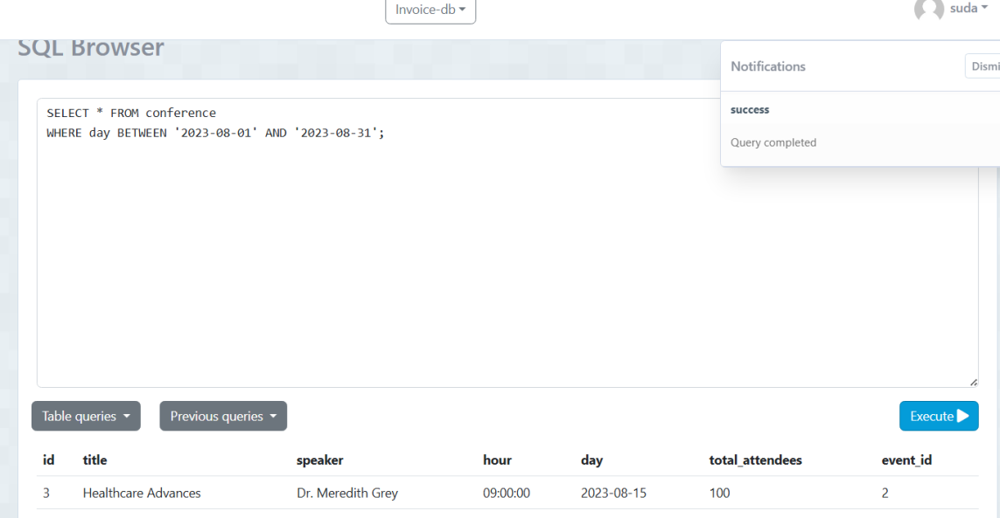

3. Filtrar los eventos en los cuales han asistido menos de 200 personas:
SELECT event.*
FROM event
JOIN conference ON event.id = conference.event_id
WHERE conference.total_attendees < 200;
selecciona todas las columnas de la tabla event para aquellos eventos que están asociados a conferencias con menos de 200 asistentes.
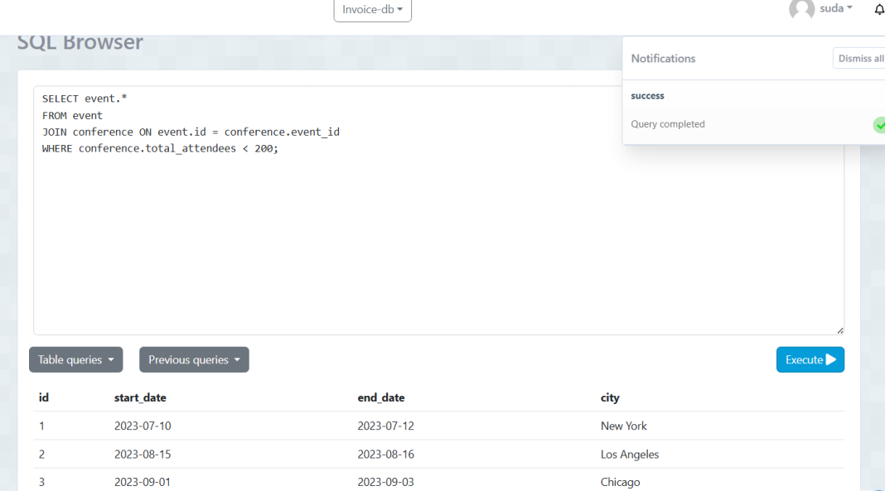

4. Filtrar si un miembro asisió o no a la conferencia, filtrando el id del registro, id del miembro y si asistió o no:
SELECT id AS register_id, member_id, assisted
FROM register;
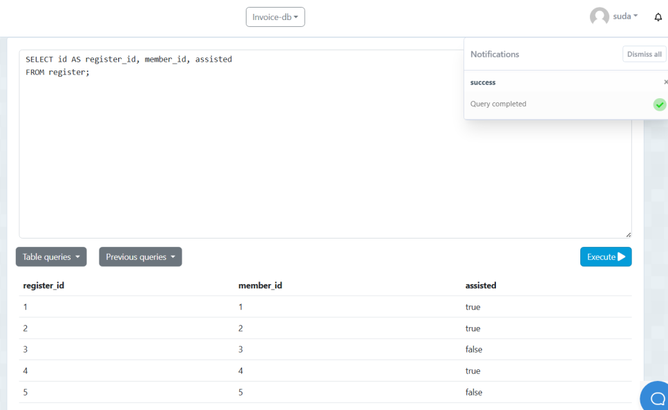
selecciona tres columnas de la tabla register: id, member_id y assisted. Además, renombra la columna id como register_id en el resultado de la consulta.

5. Filtrar un registro que se ha registrado el día 2024-06-01
SELECT * FROM register
WHERE registered_at = '2023-06-01';
selecciona todos los registros de la tabla register donde el valor de la columna registered_at es igual a '2023-06-01'.
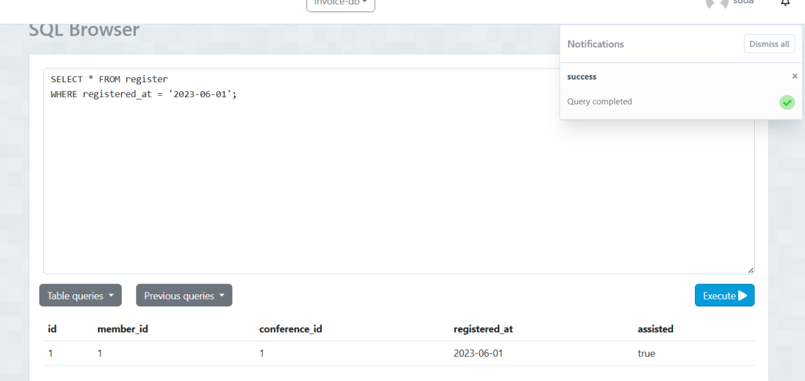

